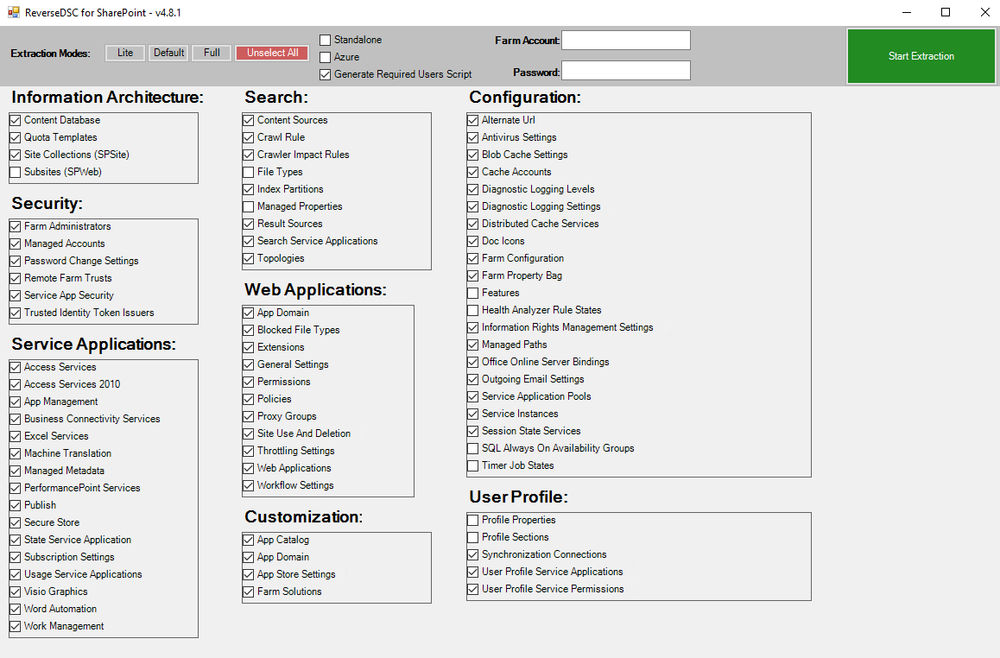

SharePoint Farms have multiple components on every server which contain configuration.
At a very high level this could be:

- Web Applications
- Databases
- Servers
- Services
- Service Applications

PowerShell Desired State Configuration has the ability to make sure these components are compliant
with a desired state. Unfortunately it is not possible to create a desired state configuration
based off an existing server/farm.

That is why Nik Charlebois created [ReverseDsc](https://www.powershellgallery.com/packages/ReverseDSC).
This module offers generic functionalities to generate DSC configurations and requires a technology
specific orchestrator script to export the data.

> For a _[Full list](Understanding-Resources)_ of what can be extracted have a look at our Included Resources section.

Since SharePointDsc v4.5, this orchestrator script (and therefore ReverseDsc support) has been
natively integrated into SharePointDsc.

>**NOTE:** Running an export does require the module "ReverseDsc" to be installed. Do this by running the following cmdlet:
>
> ```PowerShell
> Install-Module ReverseDsc
> ```

To run an export you have to use the `Export-SPConfiguration` cmdlet. When running an export, you
need to specify which resources you want to export. If you don't specify any parameters, the cmdlet
shows a GUI in which you can select the resources you want to export and specify the credentials.



For more information and examples, check the info below.

## Parameters

| Parameter | Attribute | DataType | Description | Allowed Values |
| --- | --- | --- | --- | --- |
| **ComponentsToExtract** | Optional | String[] | Names of the resources to export | |
| **Credentials** | Optional | PSCredential | The credentials to connect to SharePoint with | |
| **Mode** | Optional | String | Predefined sets of exported resources | Lite, Default, Full |
| **OutputPath** | Optional | String | Specifies the file name to which to export the exported configuration  | |
| **SkipSitesAndWebs** | Optional | Switch | Include Sites and Webs in the output (Default = True) | |
| **Standalone** | Optional | Switch | Create export as if the farm is using a single server | |
| **Quiet** | Optional | Switch | (Deprecated) Run the export without showing the GUI | |

## Examples

### Example 1

Run an export by using the GUI

```PowerShell
Export-SPConfiguration
```

### Example 2

Run an unattended export by specifying the resources

```PowerShell
$credential = Get-Credential domain\farmadministrator
Export-SPConfiguration -ComponentsToExport "SPInstall", "SPFarm", "SPManagedAccount" -Credentials $credential -OutputPath 'C:\DscExport'
```

### Example 3

Run a full export by specifying the export mode

```PowerShell
$credential = Get-Credential domain\farmadministrator
Export-SPConfiguration -Mode 'Full' -Credentials $credential -OutputPath 'C:\DscExport'
```
